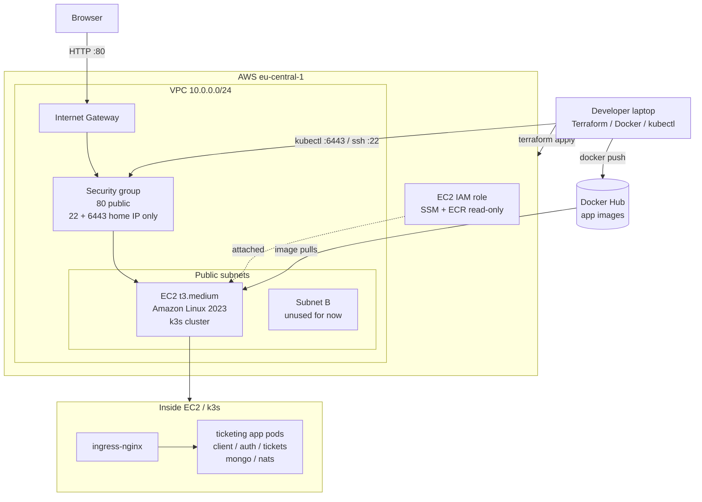

# AWS Infrastructure Diagram

Abstract view of the current AWS demo deployment.

## Notes

- Terraform owns AWS infrastructure; Kubernetes manifests are applied after k3s is ready.
- There is no AWS Load Balancer yet; HTTP enters through the EC2 public IP.
- No NAT Gateway, RDS, Route 53, ACM, or ECR repositories are used yet.
