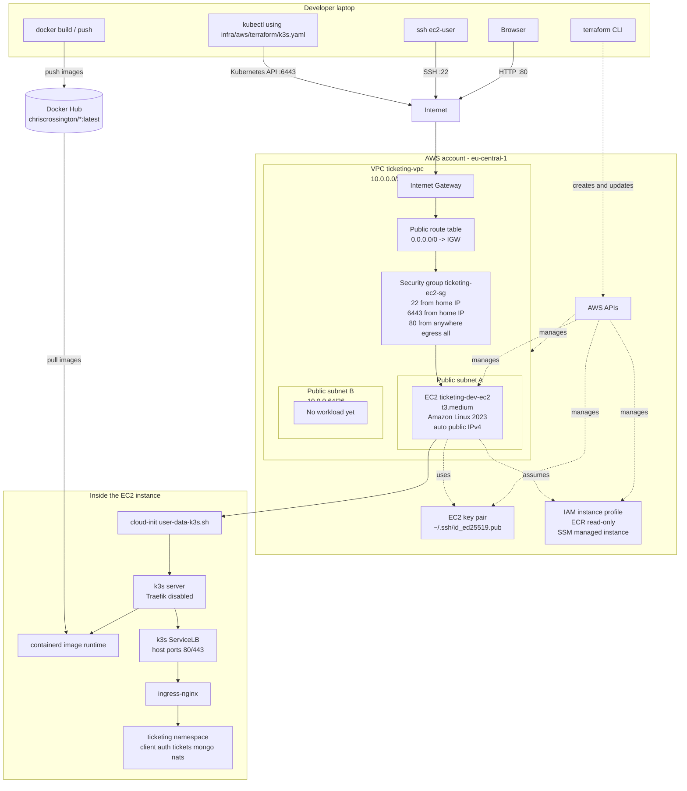

# AWS Infrastructure Diagram

Ground truth for the current AWS demo created from `infra/aws/terraform/` and bootstrapped by `infra/aws/scripts/k3s-bootstrap.sh`.

## Key points

- Terraform creates AWS infrastructure and installs k3s through EC2 user data.
- The bootstrap script installs ingress-nginx and applies Kubernetes manifests.
- There is no AWS load balancer; k3s ServiceLB exposes ingress-nginx on the EC2 host.
- There is no NAT Gateway, ALB, Route 53, ACM, RDS, or ECR repository yet.
- Public HTTP is used for the demo; app manifests set `COOKIE_SECURE=false`.
