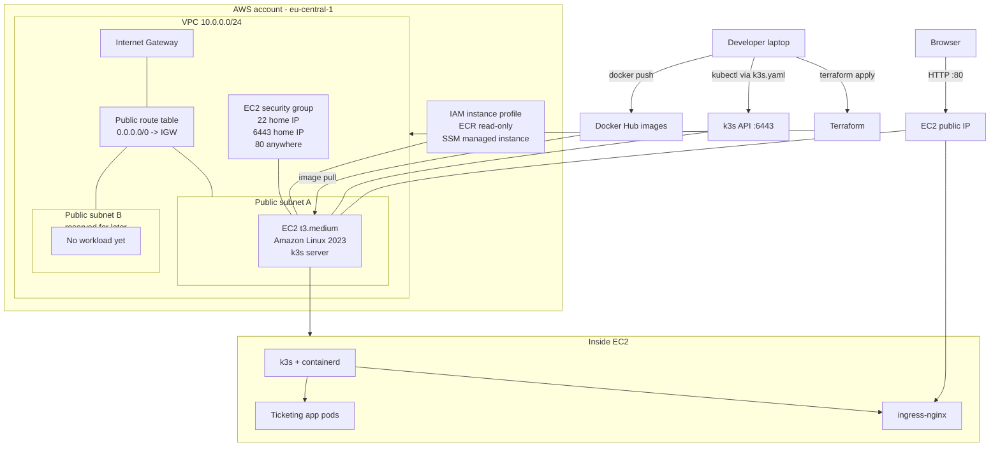

# AWS Infrastructure Diagram

Current AWS demo environment created from `infra/aws/terraform/`.

## Notes

- No ALB, NAT Gateway, Route 53, ACM, RDS, or ECR repos yet.
- Public HTTP is used for the demo; app manifests set `COOKIE_SECURE=false`.
- `6443` is open only to the hardcoded home IP for laptop `kubectl`.
