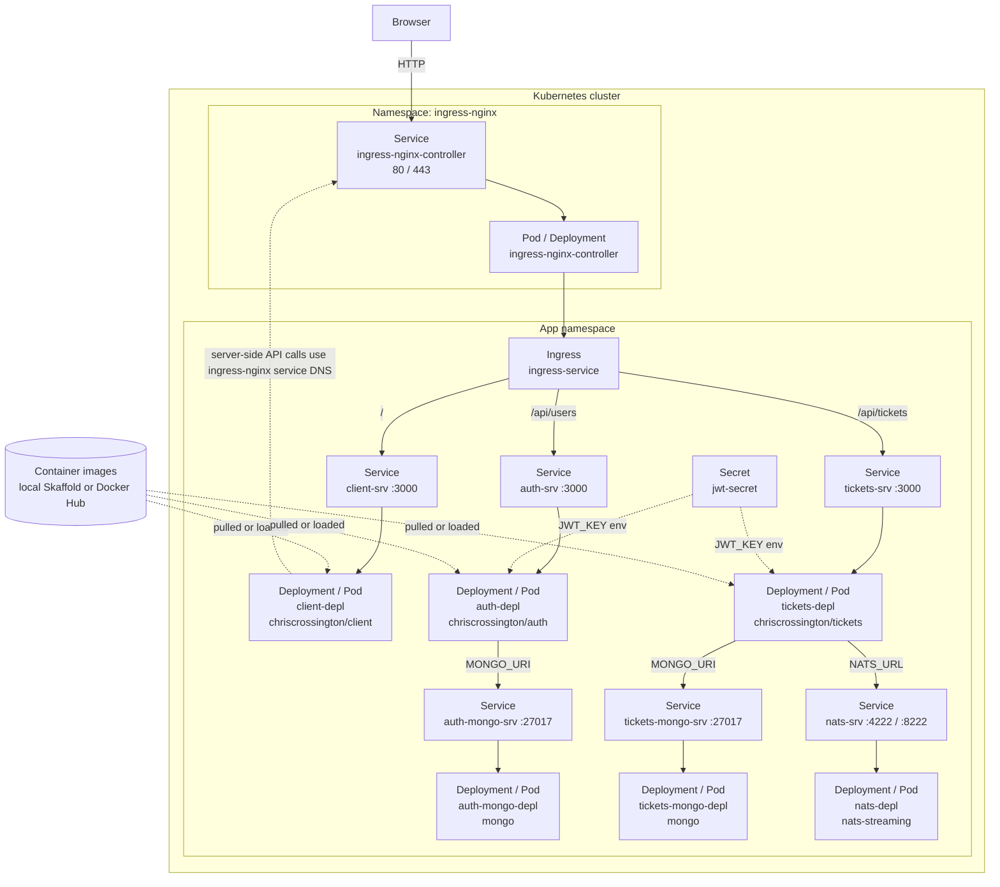

# Kubernetes Infrastructure Diagram

Ground truth for the Kubernetes app shape. Local Docker Desktop uses `infra/k8s/`; AWS k3s uses `infra/aws/k3s-mirror/`.

## Environment differences

| Concern | Local Docker Desktop | AWS k3s mirror |
| --- | --- | --- |
| Manifests | `infra/k8s/` | `infra/aws/k3s-mirror/` |
| Image source | local Skaffold build | Docker Hub `:latest` |
| Namespace | default | `ticketing` |
| Public entry | `http://ticketing.dev` | `http://EC2_PUBLIC_IP` |
| Ingress host rule | `ticketing.dev` | no host rule |
| Cookie security | secure by default | `COOKIE_SECURE=false` for HTTP demo |
| Databases | MongoDB pods | MongoDB pods |
| Event bus | NATS Streaming pod | NATS Streaming pod |

## Key points

- Ingress routes HTTP to Services; Services select Pods created by Deployments.
- Auth and tickets both read `JWT_KEY` from `jwt-secret`.
- MongoDB and NATS are in-cluster demo dependencies, not managed cloud services.
- No persistent volumes are configured for MongoDB in this demo.
