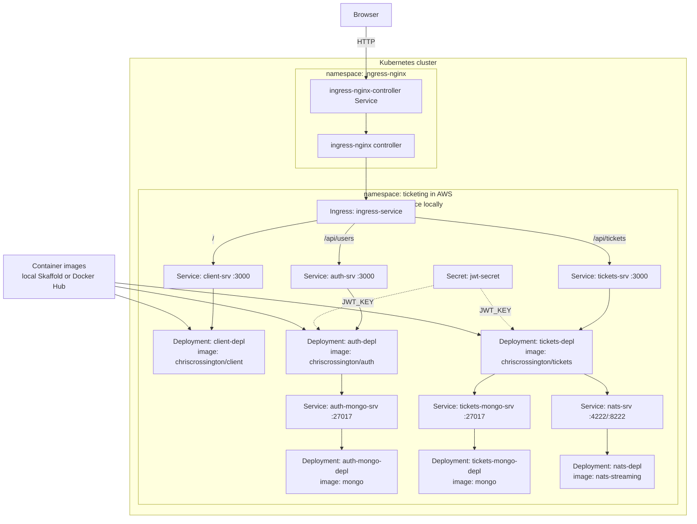

# Kubernetes Infrastructure Diagram

Logical Kubernetes environment used by local Docker Desktop and AWS k3s.

## Environment differences

| Concern | Local Docker Desktop | AWS k3s mirror |
| --- | --- | --- |
| Manifests | `infra/k8s/` | `infra/aws/k3s-mirror/` |
| Images | local Skaffold build | Docker Hub `:latest` |
| Namespace | default | `ticketing` |
| Ingress host | `ticketing.dev` | no host; EC2 public IP |
| Cookie security | normal app default | `COOKIE_SECURE=false` for HTTP demo |
