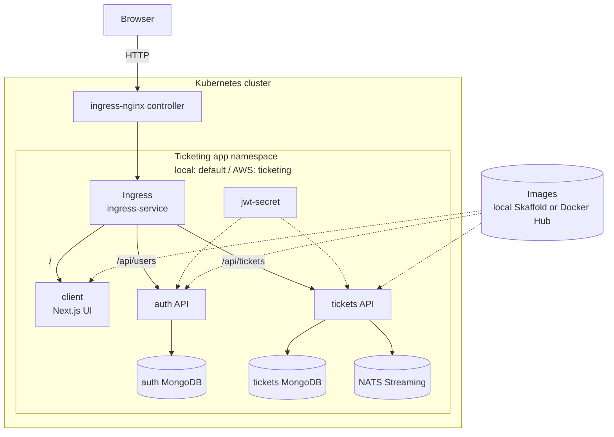

# Kubernetes Infrastructure Diagram

Abstract view of the app running in Kubernetes.

## Local vs AWS mirror

| Concern | Local | AWS k3s |
| --- | --- | --- |
| Manifests | `infra/k8s/` | `infra/aws/k3s-mirror/` |
| Images | local Skaffold | Docker Hub `:latest` |
| Public URL | `ticketing.dev` | EC2 public IP |
| Namespace | default | `ticketing` |
| Cookie mode | secure default | `COOKIE_SECURE=false` for HTTP demo |

## Notes

- Ingress is the public HTTP router.
- MongoDB and NATS are demo pods inside the cluster, not managed services.
- MongoDB has no persistent volumes in this version.
